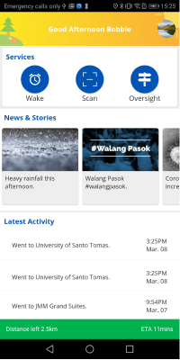
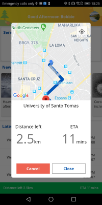
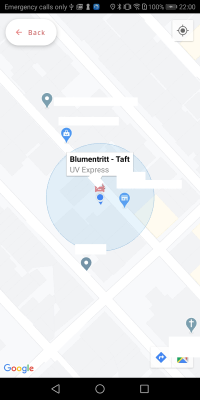
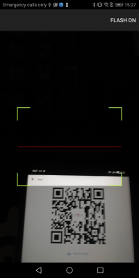

# Stohp

Stohp application is a commuter utility application that aims to alleviate the pain
points daily commuters experience. This is a two part app you can find the companion application [here](https://github.com/SeanErvinson/stohp-driver-app).

## Prerequisite
- Flutter
- Android IDE
- Android SDK 28 or Oreo above

## Application






## Getting Started

Clone the project or download the zip file.
```
git clone <project_url>
```

To run the application. Open an emulator or connect an appropriate device.
```
flutter run
```

Google Map API key is required to run the map. For more information check out
https://pub.dev/packages/google_maps_flutter